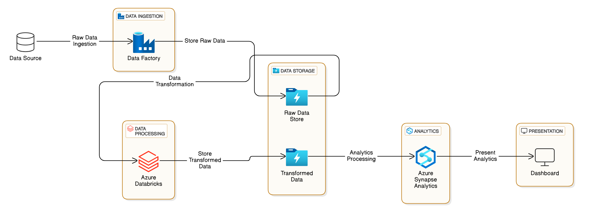

# Tokyo-olympic-data-engineering-project

## Introduction
This project processes and analyzes Tokyo Olympic data using Azure services. It ingests data into Azure Data Lake Gen2, transforms it with Azure Databricks, and visualizes insights through dashboards in Azure Synapse Analytics.

## About Dataset

This contains the details of over 11,000 athletes, with 47 disciplines, along with 743 Teams taking part in the 2021(2020) Tokyo Olympics.
This dataset contains the details of the Athletes, Coaches, Teams participating as well as the Entries by gender. It contains their names, countries represented, discipline, gender of competitors, name of the coaches.

Dataset Link - https://www.kaggle.com/datasets/arjunprasadsarkhel/2021-olympics-in-tokyo

## Architecture

# Technology Used
1.Programming Language - Python
2.Scripting Language - SQL
3.Azure Cloud Platform
  - Azure Data Factory
  - Data Lake Gen 2
  - Azure Databricks
  - Azure synapse Analytics
